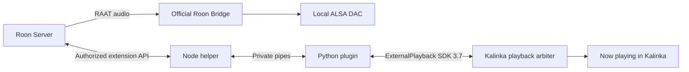

# Integration decisions

## Two independent Roon components

The official [Linux Bridge distribution](https://help.roonlabs.com/portal/en/kb/articles/linux-install)
owns discovery, RAAT and ALSA. A small Node child uses the official
[Roon extension API](https://github.com/RoonLabs/node-roon-api) to pair to one
Server, subscribe to zones, retrieve artwork and control a selected output.
The Python plugin manages both, translates state and participates in Kalinka
playback arbitration. No RAAT reimplementation or log scraping is needed.

The official installers identify these downloads (checked during development):

| Linux userspace | Official archive |
| --- | --- |
| x86-64 | `https://download.roonlabs.net/builds/RoonBridge_linuxx64.tar.bz2` |
| ARM64 | `https://download.roonlabs.net/builds/RoonBridge_linuxarmv8.tar.bz2` |
| ARMv7 hard-float | `https://download.roonlabs.net/builds/RoonBridge_linuxarmv7hf.tar.bz2` |

A 32-bit Python on an ARM64 kernel selects ARMv7, subject to Roon's dependency
checker. Unsupported machines fail explicitly. HTTPS authenticates the
download origin; Roon does not supply an independently pinned signature in
this installation flow. This plugin does not claim otherwise.

## Ownership contract

`ExternalPlayback` is a separate SDK interface because `DirectPlayback`
claims a Kalinka renderer and expects a playable source. An external session
publishes existing `PlaybackState` and `PlaybackControl` events, so existing
Kalinka clients already display the badge, metadata and progress. The host
stamps progress using its own monotonic clock; Roon positions are converted
from seconds to milliseconds.

Companion implementation: [KalinkaPlayer PR #250](https://github.com/Kalinka-Player/KalinkaPlayer/pull/250),
initial commit `1212845eaaf6fefa3e8b30464db3a53a0009e86a`.

Roon's [documented `stop` control](https://github.com/RoonLabs/node-roon-api-transport/blob/master/lib.js)
releases the audio device immediately. The plugin's revoke callback waits
up to one second for its reply, and falls back to terminating the Bridge
process group. The entire callback fits within Kalinka's three-second plugin
budget. It does not reenter the arbiter while the host is waiting for it.

For the opposite direction, the extension provides Roon's official
[`sourcecontrol:1` service](https://github.com/RoonLabs/node-roon-api-source-control/blob/master/lib.js).
The user associates it with the selected output in Roon's Device Setup.
`convenience_switch` becomes a private request to Python. Python acquires the
external hold, awaiting the old renderer's `SessionClosed` acknowledgement,
then waits for the shared sound server to relinquish the hardware. The default
6-second allowance covers WirePlumber's usual 5-second idle suspend; direct
ALSA installations can set it to zero. With a configured DAC `hw_params`,
Python polls for `closed` and fails the switch if the device remains busy at
the deadline. Without it, the allowance cannot guarantee hardware availability.

Only then does the extension respond `Success` and mark its source selected.
Revocation or release marks it deselected so the next Roon start switches
again. Unanswered switches expire after 15 seconds; acquired holds without
subsequent loading/playing expire after 10 seconds. Quiet snapshots caused by
the source-status update do not cancel a pending start. Revocation during
the device wait invalidates the request; late replies/timeouts cannot reclaim
the output. Playback-event fallback remains available, with its inherent
device-open race; there are no automatic transport Play retries.

The extension and Bridge share the Kalinka service cgroup. Normal plugin
shutdown also terminates their process groups, including children that ignore
SIGTERM. Pairing is persisted atomically with private permissions. An advisory
lock prevents two plugin instances sharing one state directory. All network
discovery/retries, installation and process startup run outside plugin setup's
latency budget. Loss of the extension is treated as loss of control over audio:
Bridge is stopped, ownership is released and the supervisor retries.

No automatic selection by zone name is attempted. Output IDs are opaque;
the user confirms the local DAC during setup. A remote Roon output and an
unselected second local output are outside this plugin's arbitration. Changing
the selected output restarts the plugin through Kalinka's existing config flow.

## Topology limits

There are two separate ownership questions: which source this server displays
and controls, and which process holds the DAC on Bridge's host. The current
SDK arbiter answers the first; it does not provide a host-wide audio lease.

| Playback topology | Current behavior when Roon acquires the server hold |
| --- | --- |
| This server owns the local renderer's session | The session is closed and its acknowledgement is awaited. PipeWire may still need time to suspend the underlying hardware. |
| This server plays through a remote renderer | The remote session is closed even though it does not conflict with the local DAC. |
| Another server owns the local renderer's session | That session is not closed. The renderer deliberately accepts close requests only from the session's owner. |
| No local Kalinka renderer | Bridge can play locally, but this server's remote queue still follows the single-source arbitration policy. |

A distributed implementation needs an audio lease on the renderer host,
independent of the server currently sending its stream. It must stop the local
renderer and notify its owning server when Roon takes over, and await Roon's
stop when any server starts that local renderer. It must also keep unrelated
remote playback separate from that lease. Merely identifying a local renderer
or sending a foreign SessionClose cannot provide those guarantees. The
current plugin does not implement that lease, and must not claim otherwise.

## Diagnosing repeated device-open failures

Check **Automatic audio handover** in Kalinka settings and the source-switch
messages in the server log. A loading/playing notification without a preceding
source-switch request uses the fallback path: Roon has already started opening
audio, so the handover allowance cannot protect that attempt. Enable the
extension and separately associate its source control with the chosen output
in Roon's Device Setup. A received source-switch request is logged, followed
by either readiness with elapsed time or failure. If readiness is logged but
ALSA remains busy, check the configured DAC's `hw_params` and which process is
holding it; another server's local renderer session is outside current control.

The server build also matters. SDK 3.7 alone does not identify the renderer
close-acknowledgement fix: the companion branch must include commit
`a15c1681ab8ebd0cd2c58dc84ffa64106f1a2674` or a later descendant.

## Hardware acceptance procedure

1. On x86-64, ARM64 and ARMv7hf targets enable the plugin, check download and
   startup status, and verify Bridge advertises the expected ALSA device.
2. Authorize the extension, enable the local audio device, and select its
   output ID in Kalinka. Associate **Kalinka Roon Bridge** under **External
   Source Controls** in Roon's Device Setup. Verify pairing and this mapping
   survive a service restart.
3. Start Roon playback. Verify title/artist/album/artwork, duration, seek
   progress, the Roon endpoint badge, radio without a duration, and permitted
   next/previous/seek controls. Rename the zone and repeat.
4. Alternate local queue, another Connect plugin and Roon. Verify no overlap,
   no lost queue contents, and that the DAC is released before the new source
   opens it. Include Roon start while the Kalinka renderer owns ALSA exclusively.
   Repeat on PipeWire with its default idle suspend, including a Kalinka stop
   immediately followed by Roon play. Compare a 6-second handover allowance
   with a configured `hw_params` check; direct ALSA should use a zero allowance.
   Start Kalinka during the wait and verify the pending Roon switch fails.
5. Pause and Stop from Roon and from Kalinka. Resume in Roon. Include grouping
   and ungrouping; confirm stop intentionally affects the selected zone's group.
6. Disconnect Roon Server during playback and kill the Node helper. Verify
   silence, released Kalinka ownership, process cleanup, retry status and
   pairing recovery. Delayed playing events must not steal a later source.
7. Disable the plugin during playback and verify no managed Roon process remains.
8. For optional hardware details, select the correct `hw_params` and compare
   rate/channels to ALSA and Roon's own signal path. Source format stays unknown.

Automated tests and package builds do not replace these hardware checks.
